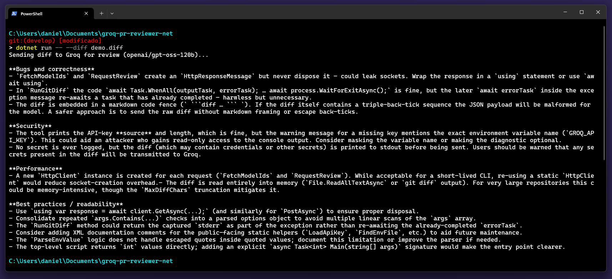
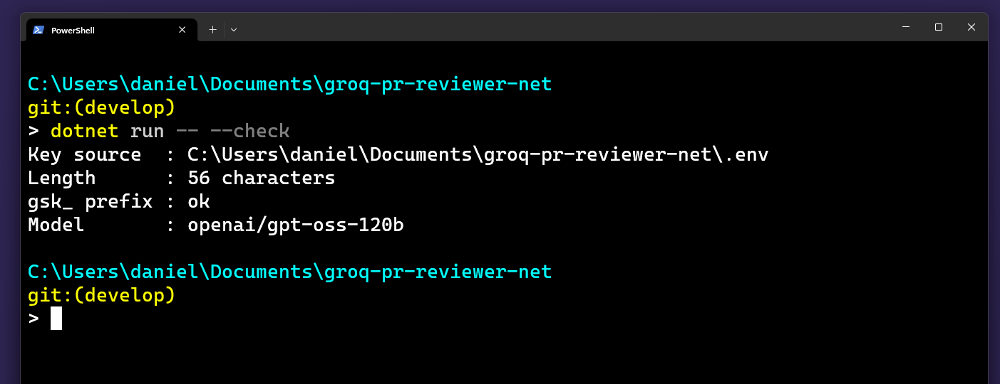
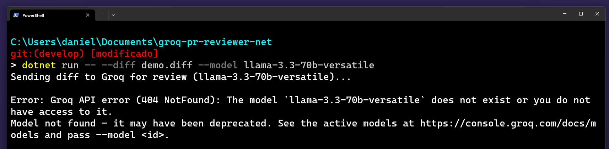
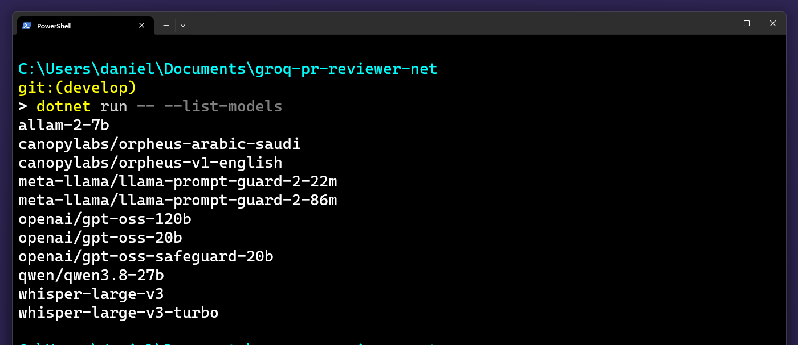

# groq-pr-reviewer-net

[](https://dotnet.microsoft.com)
[](https://huggingface.co/openai/gpt-oss-120b)
[](https://huggingface.co/openai/gpt-oss-120b)
[](https://groq.com)
[](LICENSE)
[](https://hacktoberfest.com)

A C# (.NET 10) CLI that reviews your `git diff` using an open-weight model
(`openai/gpt-oss-120b`, Apache 2.0) running on Groq's ultra-fast inference.

Point it at any git repository and it prints a structured code review in your
terminal — before you open the pull request.

```bash
dotnet run -- --staged
```



_Above: the tool reviewing its own source code._

## Why open-source AI here?

- **Open weights.** The default model ships under Apache 2.0: you can swap it for
  another one at any time, or run it elsewhere. No vendor lock-in — and when a
  model is retired, `--list-models` plus `--model` gets you moving again without
  touching the code.
- **Zero cost.** Groq's free tier comfortably covers an individual developer's usage.
- **No dependency on paid review tooling.** Anyone in the community can clone
  this and use it today.
- **Your diff stays in your control.** You choose the provider and the model, instead
  of handing your code to whatever closed service a paid tool happens to wrap.

## Setup

1. Create a free API key at [console.groq.com/keys](https://console.groq.com/keys).

   > ⚠️ **Groq is not Grok.** [Groq](https://groq.com) (keys start with `gsk_`) is an
   > inference provider for open models. [xAI's Grok](https://x.ai) (keys start with
   > `xai-`) is an unrelated company with proprietary models. The names are nearly
   > identical and it is an easy mistake — this CLI will tell you if you mix them up.

2. Copy `.env.example` to `.env` and paste your key:
   ```
   GROQ_API_KEY=your_key_here
   ```
   `.env` is gitignored, so your key never reaches the repository.

3. Build:
   ```bash
   dotnet build
   ```

4. Verify your setup without spending a request:
   ```bash
   dotnet run -- --check
   ```
   This reports where the key was loaded from, its length and whether it has the
   expected shape — without ever printing the key itself.

   

## Usage

Run it inside any git repository that has changes:

```bash
# review unstaged changes (git diff)
dotnet run --project /path/to/groq-pr-reviewer-net --

# review staged changes (git diff --staged)
dotnet run --project /path/to/groq-pr-reviewer-net -- --staged

# review a specific .diff/.patch file
dotnet run --project /path/to/groq-pr-reviewer-net -- --diff path/to/file.diff

# point at another repository
dotnet run --project /path/to/groq-pr-reviewer-net -- --repo /another/repo

# use a different Groq model
dotnet run --project /path/to/groq-pr-reviewer-net -- --model qwen/qwen3.8-27b

# see which models your key can reach
dotnet run --project /path/to/groq-pr-reviewer-net -- --list-models
```

Or publish it as a single executable and call it from anywhere:

```bash
dotnet publish -c Release -r win-x64 --self-contained -o publish
```

### Options

| Option | Description |
| --- | --- |
| `--staged` | Review staged changes (`git diff --staged`) |
| `--diff <file>` | Review a `.diff`/`.patch` file instead of running git |
| `--repo <path>` | Target repository (default: current directory) |
| `--model <id>` | Groq model id (default: `openai/gpt-oss-120b`) |
| `--check` | Validate the API key setup without calling the API |
| `--list-models` | List the model ids available to your key |
| `--help`, `-h` | Show help |

## Output

The CLI sends the diff to the model via Groq and prints a review organised into:

- Bugs and correctness
- Security
- Performance
- Best practices / readability

Diffs longer than 60,000 characters are truncated so they fit the model's context
window, and you get a warning on stderr when that happens.

Treat the output as a fast second opinion, not as truth. An open model with a
knowledge cutoff will occasionally flag things that are not real — in our own
dogfooding run it claimed `net10.0` was not a valid target framework and that a
`using System.Linq;` was missing, both wrong. It also caught a genuine
sync-over-async issue in the same pass. Read it the way you would read a
well-meaning junior reviewer.

## When a model is retired

Hosted model catalogues change. This project was originally built on
`llama-3.3-70b-versatile`, which was removed from Groq while it was being written:



The error tells you what to do next. Ask your key what it can actually reach:

```bash
dotnet run -- --list-models
```



Then pass any of them with `--model`. Because every model sits behind the same
OpenAI-compatible endpoint, recovering from a deprecation is a flag change, not a
rewrite — that is the practical payoff of building on open weights.

## ⚠️ Your diff leaves your machine

The diff is sent verbatim to Groq's API. If your changes contain credentials,
tokens or customer data, they go too. Before reviewing, check what is staged —
`git diff --staged --stat` is a good habit. This tool deliberately never reads or
transmits your `.env`, but it cannot tell a secret inside a diff from ordinary code.

_(Fittingly, this warning exists because the tool flagged it while reviewing itself.)_

## Configuration notes

- `GROQ_API_KEY` can come from a real environment variable or from a `.env` file.
  **The environment variable wins** if both are set — `--check` tells you which one
  was used.
- The `.env` file is looked up from the current directory upwards, so the published
  executable finds it too.

## Contributing

Issues and pull requests are welcome. The whole tool is about 300 lines across
five files, with no dependencies beyond the .NET base class library, so it should
take about ten minutes to read end to end before you change anything:

| File | Responsibility |
| --- | --- |
| `Program.cs` | Entry point: wires the pieces together and handles output |
| `CliOptions.cs` | Argument parsing and the usage text |
| `ApiKeyLoader.cs` | Resolves `GROQ_API_KEY` from the environment or `.env` |
| `GitDiff.cs` | Runs `git diff` and captures its output |
| `GroqClient.cs` | Talks to Groq: reviews, model listing, error messages |

Good first contributions: support for more providers via a `--provider` flag,
reviewing a GitHub PR by URL, or a `--lang` flag so the review comes back in your
own language.

## License

MIT — use it, fork it, change the model.
